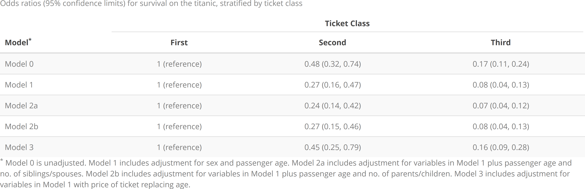

<!-- README.md is generated from README.Rmd. Please edit that file -->

```{r, include = FALSE}

rm(list=ls())

knitr::opts_chunk$set(
  collapse = TRUE,
  comment = "#>",
  fig.path = "man/figures/README-",
  out.width = "100%"
)
```

# rpriori

<!-- badges: start -->
[](https://travis-ci.org/njtierney/rpriori)
[](https://ci.appveyor.com/project/njtierney/rpriori)
[](https://www.tidyverse.org/lifecycle/#experimental)
<!-- badges: end -->

The goal of `rpriori` is to 

## Installation

You can install the development version from [GitHub](https://github.com/) with:

``` r
# install.packages("remotes")
remotes::install_github("bcjaeger/rpriori")
```
# Logistic regression 

Here are the packages we'll use for this example:

```{r setup, message = FALSE, warn = FALSE}

library(rpriori)
library(magrittr)
library(glue)
library(tidyverse)
library(knitr)
library(kableExtra)

library(geepack)

```


Let's use the `titanic` data to show how the pieces of `rpriori` fit together. The first thing we need is a question that we can engage with using a-priori models. Let's investigate whether survival on the titanic was associated with ticket class. We'll start by initiating an empty model.

```{r}

# Make an unadjusted model
m0  <- spec_empty("Model 0")

# spec_describe(spec) is the same as print(spec)
spec_describe(m0)

```

Now we can Model 1, a descendant of the unadjusted model.

```{r}

# Model 1 includes adjustment for sex and age
m1  <- spec_add(m0, name = "Model 1", sex, age)

m1

# model 0 is automatically set as the parent since m0
# was supplied to spec_add.
m1$parent$name

# relation is automatically set by the spec_add function
m1$relation

```

And now we can make descendants of model 1.

```{r}

# Model 2a = model 1 + no. of siblings/spouses
m2a <- spec_add(m1, name = 'Model 2a', sibsp)

# Model 2b = model 1 + no. of parents/children
m2b <- spec_add(m1, name = 'Model 2b', parch)

# Model 3 = model 1, swapping out age for ticket fare
m3 <- spec_sub(m1, name = 'Model 3', age = fare)

```

What comes next? Our specifications are set, but they are separate. They also haven't been embedded into the main question of interest, i.e. `survival ~ pclass`. We can pull these specifications together into an object that encapsulates our main hypothesis with `spec_embed` 

```{r}

main_hypothesis <- survived ~ pclass

analysis <- main_hypothesis %>% 
  spec_embed(m0, m1, m2a, m2b, m3)

analysis

```

The next step is to fit models defined by the specifications in `analysis`. Here, we use the `fit_apri()` function, which spans multiple different modeling frameworks, including 

1. linear and generalized linear models (`engine = 'lm'` and `engine = 'glm'`, respectively), 

2. generalized linear models fit with generalized estimating equations (`engine = 'gee'`), and 

3. Cox proportional hazards models (`engine = 'cph'`). 

Additionally, `fit_apri()` is designed to work with lists of formulas, making it pair well with the `mutate()` function in the `dplyr` package.

```{r}


# formulas = analysis$formula
# data = drop_na(titanic)
# light_output = TRUE
# family = binomial(link = 'logit')
# engine = 'glm'

analysis %<>%
  mutate(
    fits = fit_apri(
      formulas = formula,
      data = drop_na(titanic),
      light_output = TRUE,
      family = binomial(link = 'logit'),
      engine = 'glm'
    )
  )


```

Now we can dig a little deeper into these models. How about we start by peeking at the effects of our main exposure? To hoist these effects out of the model objects, we use the `hoist_effect()` function. The main input to this function is a data frame containing a list (or lists) of model fits. If we want to get the effect of `pclass` from each model, we just specify `effect = pclass`. 

```{r}

analysis %>% 
  hoist_effect(fits, effect = pclass)

```

Neat, but maybe not as easy to read as it could be. `hoist_effect` has a few aesthetic helper inputs to make model output a little easier to interpret. For example, instead of looking at estimates on the log-scale, we can exponentiate them:

```{r}

analysis %>% 
  hoist_effect(fits, effect = pclass, transform = exp)

```

Okay! Now we have odds-ratios instead of regression coefficients, and we can easily see that, according to the apriori models we specified, ticket class has a pretty strong effect. A natural follow-up question is how much uncertainty we have regarding those point estimates, and a natural follow-up answer is to use the `ci` input argument of `hoist_effect` like so:

```{r}

analysis %>% 
  hoist_effect(fits, effect = pclass, ci = 0.95, transform = exp)


```

This type of output can be passed right into your favorite table function.

```{r, eval = FALSE}

footer <- list(m0, m1, m2a, m2b, m3) %>% 
  map_chr(spec_describe)

analysis %>% 
  hoist_effect(fits, effect = pclass, ci = 0.95, transform = exp) %>% 
  select(name, First, Second, Third) %>% 
  kable(
    col.names = c(glue("Model{footnote_marker_symbol(1)}"), names(.)[-1]), 
    align = 'lccc', 
    format = 'html',
    escape = FALSE,
    caption = glue("Odds ratios (95% confidence limits) \\
      for survival on the titanic, stratified by ticket class")
  ) %>% 
  kable_styling(full_width = FALSE, bootstrap_options = c('striped')) %>% 
  add_header_above(header = c(" " = 1, "Ticket Class" = 3)) %>% 
  footnote(symbol = glue_collapse(footer, sep = ' '))

```


```{r, echo = FALSE}

#save_kable(tmp, file = 'fig/kable_example1.png', zoom = 4)


```

# Proportional hazards

```{r}

data(veteran, package = 'randomForestSRC')

vet <- as_tibble(veteran) %>%
  mutate(
    trt = factor(x = trt, labels = c("Standard", "Test")),
    celltype = factor(
      x = celltype,
      labels = c('squamous', 'smallcell', 'adeno', 'large')
    ),
    prior = factor(x = prior, labels = c("No", "Yes"))
  )

m0 <- spec_empty(name = 'Unadjusted')
m1 <- spec_add(m0, name = 'Model 1', age, prior)
m2 <- spec_add(m1, name = 'Model 2', karno, diagtime)

library(survival)
library(formula.tools)

main_hypothesis <- Surv(time, status) ~ trt

analysis <- main_hypothesis %>% 
  spec_embed(m0, m1, m2) %>% 
  mutate(
    fits = fit_apri(
      formulas = formula,
      data = drop_na(vet),
      engine = 'cph'
    )
  ) %>% 
  hoist_effect(fits, trt, ci = 0.95, transform = exp, ref = "1 ref")

analysis

```

