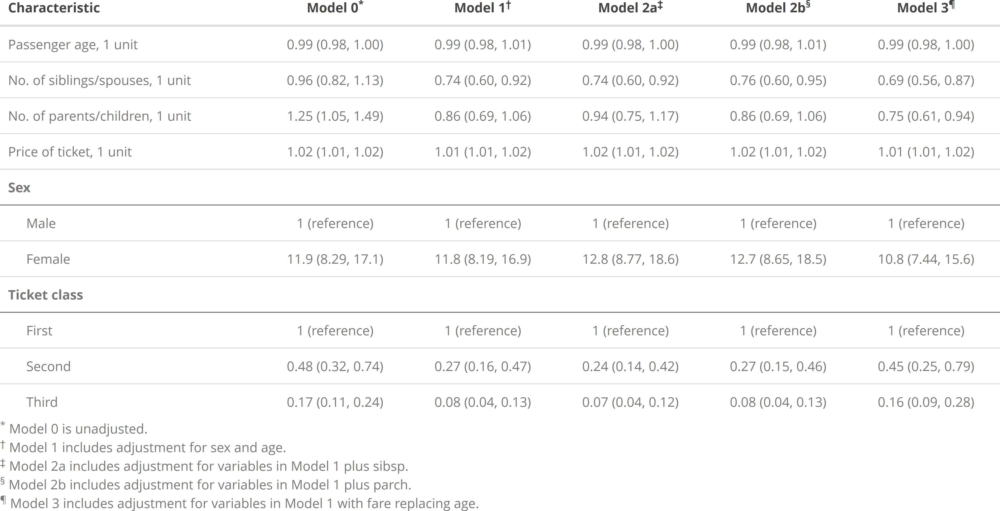

<!-- README.md is generated from README.Rmd. Please edit that file -->

```{r, include = FALSE}

knitr::opts_chunk$set(
  collapse = TRUE,
  comment = "#>",
  fig.path = "man/figures/README-",
  out.width = "100%"
)
```

# rpriori

<!-- badges: start -->
[](https://travis-ci.org/njtierney/rpriori)
[](https://ci.appveyor.com/project/njtierney/rpriori)
[](https://www.tidyverse.org/lifecycle/#experimental)
<!-- badges: end -->

The goal of `rpriori` is to provide a framework that simplifies apriori hypothesis testing. In particular, `rpriori` focuses on building sets of models that examine one primary hypothesis under several sets of potential confounding variables. 

## Installation

You can install the development version from [GitHub](https://github.com/) with:

``` r
# install.packages("remotes")
remotes::install_github("bcjaeger/rpriori")
```
## Example 

Let's use the `titanic` data to show how the pieces of `rpriori` fit together. The first thing we need is to load some packages:

```{r setup, message = FALSE, warn = FALSE}

library(rpriori)
library(magrittr)
library(glue)
library(tidyverse)
library(knitr)
library(kableExtra)
library(geepack)

```

The next thing we need is a question that we can engage with using a-priori model specifications. Let's investigate whether survival on the titanic was associated with ticket class. We'll start by initiating an empty model.

```{r}

# Make an unadjusted model
m0  <- mspec_empty("Model 0")

# mspec_describe(mspec) is the same as print(mspec)
mspec_describe(m0)

```

Now we can make Model 1, a descendant of the unadjusted model.

```{r}

# Model 1 includes adjustment for sex and age
m1  <- mspec_add(m0, name = "Model 1", sex, age)

m1

# model 0 is automatically set as the parent since m0
# was supplied to mspec_add.
m1$parent$name

# relation is automatically set by the mspec_add function
m1$relation

```

And now we can make descendants of model 1.

```{r}

# Model 2a = model 1 + no. of siblings/spouses
m2a <- mspec_add(m1, sibsp, name = 'Model 2a')

# Model 2b = model 1 + no. of parents/children
m2b <- mspec_add(m1, parch, name = 'Model 2b')

# Model 3 = model 1, swapping out age for ticket fare
m3 <- mspec_sub(m1, age = fare, name = 'Model 3')

```

What comes next? Our specifications are set, but they are separate. They also haven't been embedded into the main question of interest, i.e. `survival ~ pclass`. We can pull these specifications together into an object that encapsulates our main hypothesis with `mspec_embed` 

```{r}

ttnc <- drop_na(titanic) %>% 
  mutate(survived = as.numeric(survived) - 1)

main_hypothesis <- hypothesize_that(survived ~ pclass)

apri <- main_hypothesis %>% embed_mspecs(m0, m1, m2a, m2b, m3)

# Model descriptions are embedded as an attribute
cat(paste(attr(apri, 'model_description'), collapse = '\n'))

# Print the apriori analysis plan
apri

```

Now that we have organized an analysis plan, we can bring data into the mix. The `embed_data()` function fits into an a priori analysis workflow as the penultimate step. A dataset (or list of datasets if multiple imputation is used) is supplied as the first argument to `embed_data()`. Following this argument, key-value pairs can be supplied to set labels for variables in the analysis (see code below). For continuous variables, a label and unit can be specified by supplying a character vector, i.e., `c("label here", "units here")`.

```{r}

apri %<>% embed_data(
  data = ttnc,
  pclass = 'Ticket class',
  sex = 'Sex',
  age = c('Passenger age', 'years'), 
  sibsp = 'No. of siblings/spouses',
  parch = 'No. of parents/children',
  fare = c('Price of ticket','dollars') # (maybe pounds?)
)

# Note that embed_data transforms apri into a list
names(apri)

# But it still prints like a tibble
apri

```


The next step is to fit models defined by the specifications in `analysis`. Here, we use the `fit_apri()` function, which spans multiple different modeling frameworks, including 

1. linear and generalized linear models (`engine = 'lm'` and `engine = 'glm'`, respectively), 

2. generalized linear models fit with generalized estimating equations (`engine = 'gee'`), and 
3. Cox proportional hazards models (`engine = 'cph'`). 

Here we will use the `glm` engine to make a set of logistic regression models.

```{r}

apri_heavy <- apri %>% 
  embed_fits(
    engine = 'glm', 
    family = binomial(link = 'logit'),
    keep_models = TRUE
  )

# It's nice to check the original models, whether you 
# want to do diagnostics or just make sure they are
# specified the way you expect them to be specified.
# Keep em with keep_models = TRUE

mdls <- apri_heavy %>% 
  pull_analysis() %>% 
  pluck("fit") %>% 
  map("model")

summary(mdls[[1]])

# But sometimes you may prefer to manage your 
# memory, and model objects tend to eat that up.
# Dump em with keep_models = FALSE.

apri_light <- apri %>% 
  embed_fits(
    engine = 'glm', 
    family = binomial(link = 'logit'),
    keep_models = FALSE
  )

# Note that you can keep the original models 
# if you want, but usually all you need is
# the output from embed_fits(). Here, the 
# heavy apri object requires 35 times as
# much memory as the light version

object.size(apri_heavy) / object.size(apri_light)

# we'll use the light apri object for the
# rest of this tutorial.

rm(apri_heavy)

apri <- apri_light

```

Now we can dig a little deeper into these models. How about we start by peeking at the effects of our main exposure? To hoist these effects out of the model objects, we use the `hoist_effect()` function. The main input to this function is a data frame containing a list (or lists) of model fits. If we want to get the effect of `pclass` from each model, we just specify `effect = pclass`. 

```{r}

apri %>% 
  hoist_effect(pclass)


```

Neat, but maybe not as easy to read as it could be. `hoist_effect` has a few aesthetic helper inputs to make model output a little easier to interpret. For example, instead of looking at estimates on the log-scale, we can exponentiate them:

```{r}

apri %>% 
  hoist_effect(effect = pclass, transform = exp)

```

Now we have odds-ratios instead of regression coefficients. According to the apriori models, ticket class has a strong effect on survival. A natural follow-up question is how much uncertainty we have regarding those point estimates, and a natural follow-up answer is to use the `ci` input argument of `hoist_effect` like so:

```{r}

apri %>% 
  hoist_effect(effect = pclass, ci = 0.95, transform = exp)

```

This type of output can be passed right into your favorite table function.

```{r, eval = FALSE}

lbl <- map(apri$fit_data, attr, 'label') %>% 
  purrr::discard(is.null)

footer <- map_chr(
  .x = list(m0, m1, m2a, m2b, m3),
  .f = ~{
    .x$control <- enframe(.x$control) %>% 
      mutate(value = tolower(recode(value, !!!lbl))) %>% 
      pull(value)
    mspec_describe(.x, verbose = TRUE)
  }
)

apri %>% 
  hoist_effect(pclass, ci = 0.95, transform = exp) %>% 
  pull_analysis(name, First, Second, Third) %>% 
  kable(
    col.names = c(glue("Model{footnote_marker_symbol(1)}"), names(.)[-1]), 
    align = 'lccc', 
    format = 'html',
    escape = FALSE,
    caption = glue("Odds ratios (95% confidence limits) \\
      for survival on the titanic, stratified by ticket class")
  ) %>% 
  kable_styling(full_width = FALSE, bootstrap_options = c('striped')) %>% 
  add_header_above(header = c(" " = 1, "Ticket Class" = 3)) %>% 
  footnote(symbol = glue_collapse(footer, sep = ' '))

```


```{r, echo = FALSE}

#save_kable(tmp, file = 'fig/kable_example1.png', zoom = 4)
knitr::include_graphics('fig/kable_example1.png')

```

## Summarizing `rpriori` models

Many a-priori analyses aim to present a tabular summary of **all** the variables used for analyses, i.e., not just the main exposure. For example, a summary should show the relationship between `age` (a control variable in `m1`) and `survival` as well as the relationship between `sibsp` (is a control variable in `m2a`) and `survival`, for **all** of the given model fits. 

- In order to obtain a regression coefficient for `age` in **all** of the models for this analysis, we need to re-fit Model 0 (the unadjusted model) as `survived ~ age` instead of `survived ~ pclass`.  

- In order to obtain a regression coefficient for `sibsp` in **all** of the models for this analysis, we need to re-fit Model 0 (the unadjusted model) as `survived ~ sibsp` instead of `survived ~ pclass`, but that's not all! We also need to re-fit Model 1 as `survived ~ sibsp + sex + age` instead of `survived ~ pclass + sex + age`. 

This approach is standard for population science papers and it can also create very informative tables, but making those tables can get very tedious very quickly. `rpriori` is designed to help generate and tabulate these tables without having to fit dozens of models by hand. All we need to do is apply the `summary` function to an `apri_fit` model to get regression coefficients estimated by the recursive substitution process outlined above:

```{r}

# Summary of unadjusted relationships between survival
# and each of the variables used in this analysis, separately.
summary(apri$analysis$fit[[1]])

```

These summaries are meant to be fairly easy to manipulate using `dplyr` and other tools in the `tidyverse`. For example, the code below creates a summary for all models used in the analysis, then applies `tidyverse` functions to create a table with estimated odds ratios (95% confidence intervals) for each variable in each of the five models we specified apriori.

```{r}

lbl <- map(apri$fit_data, attr, 'label') %>% 
  purrr::discard(is.null)

apri_tbl <- apri %>%
  pull_analysis() %>% 
  mutate(mdl_smry = map(fit, summary)) %>% 
  select(name, mdl_smry) %>% 
  unnest() %>% 
  mutate(
    variable = recode(variable, !!!lbl),
    tbl_value = fmt_effect(
      effect = estimate,
      std.error = std.error,
      transform = exp,
      conf_level = 0.95,
      reference_index = which(ref),
      reference_label = '1 (reference)'
    )
  ) %>% 
  select(name, variable, level, tbl_value) %>% 
  spread(name, tbl_value) 

apri_tbl

```

With a little tomfoolery, this can be presented in a clean table suitable for a journal article. (This code will someday be formalized into a more intuitive function).

```{r, eval = FALSE}

kable_data <- apri_tbl %>% 
  group_by(variable) %>% 
  mutate(n = n()) %>% 
  ungroup() %>% 
  arrange(n, variable) %>% 
  mutate_if(is.factor, as.character) %>% 
  mutate(
    level = if_else(
      n == 1,
      paste(variable, level, sep = ', '), 
      level
    )
  )

grp_index <- table(kable_data$variable)
names(grp_index)[grp_index==1] <- " "

control <- list(m0, m1, m2a, m2b, m3)
footer <- map_chr(control, mspec_describe)

model_recoder <- control %>% 
  map_chr('name') %>% 
  paste0(footnote_marker_symbol(1:length(.)))

footnote_symbols <- kableExtra::footnote_marker_symbol(1:5)

kable_data %>% 
  select(-variable, -n) %>% 
  kable(
    align = c('l',rep('c',ncol(.)-1)),
    col.names = c("Characteristic", model_recoder),
    escape = FALSE
  ) %>% 
  kable_styling() %>% 
  pack_rows(index = grp_index) %>% 
  footnote(symbol = footer)

```


```{r, echo = FALSE}

#save_kable(tmp, file = 'fig/kable_example1.png', zoom = 4)


```


