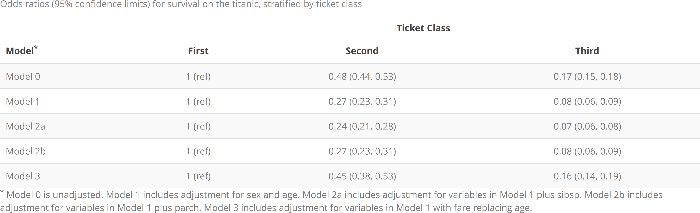
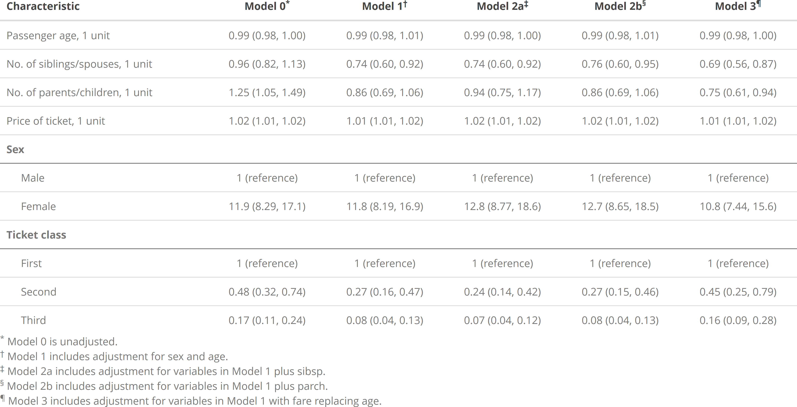

<!-- README.md is generated from README.Rmd. Please edit that file -->

# rpriori

<!-- badges: start -->

[](https://travis-ci.org/njtierney/rpriori)
[](https://ci.appveyor.com/project/njtierney/rpriori)
[](https://www.tidyverse.org/lifecycle/#experimental)
<!-- badges: end -->

The goal of `rpriori` is to provide a framework that simplifies apriori
hypothesis testing. In particular, `rpriori` focuses on building sets of
models that examine one primary hypothesis under several sets of
potential confounding variables.

## Installation

You can install the development version from
[GitHub](https://github.com/) with:

``` r
# install.packages("remotes")
remotes::install_github("bcjaeger/rpriori")
```

## Example

Let’s use the `titanic` data to show how the pieces of `rpriori` fit
together. The first thing we need is to load some packages:

``` r

library(rpriori)
library(magrittr)
library(glue)
library(tidyverse)
library(knitr)
library(kableExtra)
library(geepack)
```

The next thing we need is a question that we can engage with using
a-priori model specifications. Let’s investigate whether survival on the
titanic was associated with ticket class. We’ll start by initiating an
empty model.

``` r

# Make an unadjusted model
m0  <- mspec_empty("Model 0")

# mspec_describe(mspec) is the same as print(mspec)
mspec_describe(m0)
#> [1] "Model 0 is unadjusted."
```

Now we can make Model 1, a descendant of the unadjusted model.

``` r

# Model 1 includes adjustment for sex and age
m1  <- mspec_add(m0, name = "Model 1", sex, age)

m1
#> $name
#> [1] "Model 1"
#> 
#> $control
#> [1] "1"   "sex" "age"
#> 
#> $parent
#> $name
#> [1] "Model 0"
#> 
#> $control
#> [1] "1"
#> 
#> $parent
#> NULL
#> 
#> $relation
#> NULL
#> 
#> attr(,"class")
#> [1] "apri_mspec"
#> 
#> $relation
#> [1] "add"
#> 
#> attr(,"class")
#> [1] "apri_mspec"

# model 0 is automatically set as the parent since m0
# was supplied to mspec_add.
m1$parent$name
#> [1] "Model 0"

# relation is automatically set by the mspec_add function
m1$relation
#> [1] "add"
```

And now we can make descendants of model 1.

``` r

# Model 2a = model 1 + no. of siblings/spouses
m2a <- mspec_add(m1, name = 'Model 2a', sibsp)

# Model 2b = model 1 + no. of parents/children
m2b <- mspec_add(m1, name = 'Model 2b', parch)

# Model 3 = model 1, swapping out age for ticket fare
m3 <- mspec_sub(m1, name = 'Model 3', age = fare)
```

What comes next? Our specifications are set, but they are separate. They
also haven’t been embedded into the main question of interest,
i.e. `survival ~ pclass`. We can pull these specifications together
into an object that encapsulates our main hypothesis with `mspec_embed`

``` r

ttnc <- drop_na(titanic) %>% 
  mutate(survived = as.numeric(survived) - 1)

main_hypothesis <- survived ~ pclass

apri <- main_hypothesis %>% embed_mspecs(m0, m1, m2a, m2b, m3)

apri
#> # A tibble: 5 x 4
#>   name     outcome  exposure formula  
#>   <chr>    <chr>    <chr>    <list>   
#> 1 Model 0  survived pclass   <formula>
#> 2 Model 1  survived pclass   <formula>
#> 3 Model 2a survived pclass   <formula>
#> 4 Model 2b survived pclass   <formula>
#> 5 Model 3  survived pclass   <formula>
```

Embed data\! (fill this in)

``` r

apri %<>% embed_data(
  data = ttnc,
  pclass = 'Ticket class',
  sex = 'Sex',
  age = 'Passenger age', 
  sibsp = 'No. of siblings/spouses',
  parch = 'No. of parents/children',
  fare = 'Price of ticket'
)

names(apri)
#> [1] "analysis" "var_data" "fit_data"

apri
#> A priori model specifications for assessing survived ~ pclass: 
#>   Model 0 is unadjusted.
#>   Model 1 includes adjustment for sex and age.
#>   Model 2a includes adjustment for variables in Model 1 plus sibsp.
#>   Model 2b includes adjustment for variables in Model 1 plus parch.
#>   Model 3 includes adjustment for variables in Model 1 with fare replacing age.
#> 
#>  Analysis object 
#> # A tibble: 5 x 4
#>   name     outcome  exposure formula  
#>   <chr>    <chr>    <chr>    <list>   
#> 1 Model 0  survived pclass   <formula>
#> 2 Model 1  survived pclass   <formula>
#> 3 Model 2a survived pclass   <formula>
#> 4 Model 2b survived pclass   <formula>
#> 5 Model 3  survived pclass   <formula>
```

The next step is to fit models defined by the specifications in
`analysis`. Here, we use the `fit_apri()` function, which spans multiple
different modeling frameworks, including

1.  linear and generalized linear models (`engine = 'lm'` and `engine =
    'glm'`, respectively),

2.  generalized linear models fit with generalized estimating equations
    (`engine = 'gee'`), and

3.  Cox proportional hazards models (`engine = 'cph'`).

Here we will use the `glm` engine to make a set of logistic regression
models.

``` r


apri_heavy <- apri %>% 
  embed_fits(
    engine = 'glm', 
    family = binomial(link = 'logit'),
    keep_models = TRUE
  )

# It's nice to check the original models, whether you 
# want to do diagnostics or just make sure they are
# specified the way you expect them to be specified.
# Keep em with keep_models = TRUE

mdls <- apri_heavy %>% 
  pull_analysis() %>% 
  pluck("fit") %>% 
  map("model")

summary(mdls[[1]])
#> 
#> Call:
#> survived ~ pclass
#> 
#> Deviance Residuals: 
#>     Min       1Q   Median       3Q      Max  
#> -1.4607  -0.7399  -0.7399   0.9184   1.6908  
#> 
#> Coefficients:
#>              Estimate Std. Error z value Pr(>|z|)    
#> (Intercept)    0.6451     0.1543   4.180 2.92e-05 ***
#> pclassSecond  -0.7261     0.2168  -3.350 0.000808 ***
#> pclassThird   -1.8009     0.1982  -9.086  < 2e-16 ***
#> ---
#> Signif. codes:  0 '***' 0.001 '**' 0.01 '*' 0.05 '.' 0.1 ' ' 1
#> 
#> (Dispersion parameter for binomial family taken to be 1)
#> 
#>     Null deviance: 964.52  on 713  degrees of freedom
#> Residual deviance: 869.81  on 711  degrees of freedom
#> AIC: 875.81
#> 
#> Number of Fisher Scoring iterations: 4

# But sometimes you may prefer to manage your 
# memory, and model objects tend to eat that up.
# Dump em with keep_models = FALSE.

apri_light <- apri %>% 
  embed_fits(
    engine = 'glm', 
    family = binomial(link = 'logit'),
    keep_models = FALSE
  )

# Note that you can keep the original models 
# if you want, but usually all you need is
# the output from embed_fits(). Here, the 
# heavy apri object requires 35 times as
# much memory as the light version

object.size(apri_heavy) / object.size(apri_light)
#> 35.1 bytes

# we'll use the light apri object for the
# rest of this tutorial.

rm(apri_heavy)

apri <- apri_light
```

Now we can dig a little deeper into these models. How about we start by
peeking at the effects of our main exposure? To hoist these effects out
of the model objects, we use the `hoist_effect()` function. The main
input to this function is a data frame containing a list (or lists) of
model fits. If we want to get the effect of `pclass` from each model, we
just specify `effect = pclass`.

``` r

apri %>% 
  hoist_effect(pclass)
#> A priori model specifications for assessing survived ~ pclass: 
#>   Model 0 is unadjusted.
#>   Model 1 includes adjustment for sex and age.
#>   Model 2a includes adjustment for variables in Model 1 plus sibsp.
#>   Model 2b includes adjustment for variables in Model 1 plus parch.
#>   Model 3 includes adjustment for variables in Model 1 with fare replacing age.
#> 
#>  Analysis object 
#> # A tibble: 5 x 8
#>   name     outcome  exposure formula   fit        First Second Third
#>   <chr>    <chr>    <chr>    <list>    <list>     <dbl>  <dbl> <dbl>
#> 1 Model 0  survived pclass   <formula> <apri_fit>     0 -0.726 -1.80
#> 2 Model 1  survived pclass   <formula> <apri_fit>     0 -1.31  -2.58
#> 3 Model 2a survived pclass   <formula> <apri_fit>     0 -1.41  -2.65
#> 4 Model 2b survived pclass   <formula> <apri_fit>     0 -1.33  -2.58
#> 5 Model 3  survived pclass   <formula> <apri_fit>     0 -0.800 -1.83
```

Neat, but maybe not as easy to read as it could be. `hoist_effect` has a
few aesthetic helper inputs to make model output a little easier to
interpret. For example, instead of looking at estimates on the
log-scale, we can exponentiate them:

``` r

apri %>% 
  hoist_effect(effect = pclass, transform = exp)
#> A priori model specifications for assessing survived ~ pclass: 
#>   Model 0 is unadjusted.
#>   Model 1 includes adjustment for sex and age.
#>   Model 2a includes adjustment for variables in Model 1 plus sibsp.
#>   Model 2b includes adjustment for variables in Model 1 plus parch.
#>   Model 3 includes adjustment for variables in Model 1 with fare replacing age.
#> 
#>  Analysis object 
#> # A tibble: 5 x 8
#>   name     outcome  exposure formula   fit        First Second  Third
#>   <chr>    <chr>    <chr>    <list>    <list>     <dbl>  <dbl>  <dbl>
#> 1 Model 0  survived pclass   <formula> <apri_fit>     1  0.484 0.165 
#> 2 Model 1  survived pclass   <formula> <apri_fit>     1  0.270 0.0757
#> 3 Model 2a survived pclass   <formula> <apri_fit>     1  0.243 0.0705
#> 4 Model 2b survived pclass   <formula> <apri_fit>     1  0.265 0.0757
#> 5 Model 3  survived pclass   <formula> <apri_fit>     1  0.449 0.160
```

Now we have odds-ratios instead of regression coefficients. According to
the apriori models, ticket class has a strong effect on survival. A
natural follow-up question is how much uncertainty we have regarding
those point estimates, and a natural follow-up answer is to use the `ci`
input argument of `hoist_effect` like so:

``` r

apri %>% 
  hoist_effect(effect = pclass, ci = 0.95, transform = exp)
#> A priori model specifications for assessing survived ~ pclass: 
#>   Model 0 is unadjusted.
#>   Model 1 includes adjustment for sex and age.
#>   Model 2a includes adjustment for variables in Model 1 plus sibsp.
#>   Model 2b includes adjustment for variables in Model 1 plus parch.
#>   Model 3 includes adjustment for variables in Model 1 with fare replacing age.
#> 
#>  Analysis object 
#> # A tibble: 5 x 8
#>   name    outcome  exposure formula  fit     First    Second     Third     
#>   <chr>   <chr>    <chr>    <list>   <list>  <chr>    <chr>      <chr>     
#> 1 Model 0 survived pclass   <formul~ <apri_~ 1 (refe~ 0.48 (0.3~ 0.17 (0.1~
#> 2 Model 1 survived pclass   <formul~ <apri_~ 1 (refe~ 0.27 (0.1~ 0.08 (0.0~
#> 3 Model ~ survived pclass   <formul~ <apri_~ 1 (refe~ 0.24 (0.1~ 0.07 (0.0~
#> 4 Model ~ survived pclass   <formul~ <apri_~ 1 (refe~ 0.27 (0.1~ 0.08 (0.0~
#> 5 Model 3 survived pclass   <formul~ <apri_~ 1 (refe~ 0.45 (0.2~ 0.16 (0.0~
```

This type of output can be passed right into your favorite table
function.

``` r

footer <- list(m0, m1, m2a, m2b, m3) %>% 
  map_chr(mspec_describe)

apri %>% 
  hoist_effect(pclass, ci = 0.95, transform = exp) %>% 
  pull_analysis(name, First, Second, Third) %>% 
  kable(
    col.names = c(glue("Model{footnote_marker_symbol(1)}"), names(.)[-1]), 
    align = 'lccc', 
    format = 'html',
    escape = FALSE,
    caption = glue("Odds ratios (95% confidence limits) \\
      for survival on the titanic, stratified by ticket class")
  ) %>% 
  kable_styling(full_width = FALSE, bootstrap_options = c('striped')) %>% 
  add_header_above(header = c(" " = 1, "Ticket Class" = 3)) %>% 
  footnote(symbol = glue_collapse(footer, sep = ' '))
```



## Summarizing `rpriori` models

Many a-priori analyses aim to present a tabular summary of **all** the
variables used for analyses, i.e., not just the main exposure. For
example, a summary should show the relationship between `age` (a control
variable in `m1`) and `survival` as well as the relationship between
`sibsp` (is a control variable in `m2a`) and `survival`, for **all** of
the given model fits.

  - In order to obtain a regression coefficient for `age` in **all** of
    the models for this analysis, we need to re-fit Model 0 (the
    unadjusted model) as `survived ~ age` instead of `survived ~
    pclass`.

  - In order to obtain a regression coefficient for `sibsp` in **all**
    of the models for this analysis, we need to re-fit Model 0 (the
    unadjusted model) as `survived ~ sibsp` instead of `survived ~
    pclass`, but that’s not all\! We also need to re-fit Model 1 as
    `survived ~ sibsp + sex + age` instead of `survived ~ pclass + sex +
    age`.

This approach is standard for population science papers and it can also
creat very informative tables, but making those tables can get very
tedious very quickly. `rpriori` is designed to help generate and
tabulate these tables without having to fit dozens of models by hand.
All we need to do is apply the `summary` function to an `apri_fit` model
to get regression coefficients estimated by the recursive substitution
process outlined above:

``` r

# Summary of unadjusted relationships between survival
# and each of the variables used in this analysis.
summary(apri$analysis$fit[[1]])
#> # A tibble: 9 x 8
#>   variable term         level  ref   estimate std.error   pv_term   pv_ovrl
#>   <fct>    <fct>        <fct>  <lgl>    <dbl>     <dbl>     <dbl>     <dbl>
#> 1 pclass   pclassFirst  First  TRUE   NA        0       NA        NA       
#> 2 pclass   pclassSecond Second FALSE  -0.726    0.217    8.08e- 4  2.72e-21
#> 3 pclass   pclassThird  Third  FALSE  -1.80     0.198    1.03e-19  2.72e-21
#> 4 age      age          1 unit FALSE  -0.0110   0.00533  3.97e- 2  3.97e- 2
#> 5 sibsp    sibsp        1 unit FALSE  -0.0384   0.0828   6.43e- 1  6.43e- 1
#> 6 parch    parch        1 unit FALSE   0.220    0.0898   1.42e- 2  1.42e- 2
#> 7 fare     fare         1 unit FALSE   0.0160   0.00250  1.61e-10  1.61e-10
#> 8 sex      sexMale      Male   TRUE    0        0       NA        NA       
#> 9 sex      sexFemale    Female FALSE   2.48     0.185    6.70e-41  6.70e-41
```

These summaries are meant to be fairly easy to manipulate using `dplyr`
and other tools in the `tidyverse`. For example, the code below creates
a summary for all models used in the analysis, then applies `tidyverse`
functions to create a table with estimated odds ratios (95% confidence
intervals) for each variable in each of the five models we specified
apriori.

``` r

lbl <- map(apri$fit_data, attr, 'label') %>% 
  purrr::discard(is.null)

apri_tbl <- apri %>%
  pull_analysis() %>% 
  mutate(mdl_smry = map(fit, summary)) %>% 
  select(name, mdl_smry) %>% 
  unnest() %>% 
  mutate(
    variable = recode(variable, !!!lbl),
    tbl_value = fmt_effect(
      effect = estimate,
      std.error = std.error,
      transform = exp,
      conf_level = 0.95,
      reference_index = which(ref),
      reference_label = '1 (reference)'
    )
  ) %>% 
  select(name, variable, level, tbl_value) %>% 
  spread(name, tbl_value) 

apri_tbl
#> # A tibble: 9 x 7
#>   variable   level  `Model 0`   `Model 1`  `Model 2a` `Model 2b` `Model 3` 
#>   <fct>      <fct>  <chr>       <chr>      <chr>      <chr>      <chr>     
#> 1 Ticket cl~ First  1 (referen~ 1 (refere~ 1 (refere~ 1 (refere~ 1 (refere~
#> 2 Ticket cl~ Second 0.48 (0.32~ 0.27 (0.1~ 0.24 (0.1~ 0.27 (0.1~ 0.45 (0.2~
#> 3 Ticket cl~ Third  0.17 (0.11~ 0.08 (0.0~ 0.07 (0.0~ 0.08 (0.0~ 0.16 (0.0~
#> 4 Passenger~ 1 unit 0.99 (0.98~ 0.99 (0.9~ 0.99 (0.9~ 0.99 (0.9~ 0.99 (0.9~
#> 5 No. of si~ 1 unit 0.96 (0.82~ 0.74 (0.6~ 0.74 (0.6~ 0.76 (0.6~ 0.69 (0.5~
#> 6 No. of pa~ 1 unit 1.25 (1.05~ 0.86 (0.6~ 0.94 (0.7~ 0.86 (0.6~ 0.75 (0.6~
#> 7 Price of ~ 1 unit 1.02 (1.01~ 1.01 (1.0~ 1.02 (1.0~ 1.02 (1.0~ 1.01 (1.0~
#> 8 Sex        Male   1 (referen~ 1 (refere~ 1 (refere~ 1 (refere~ 1 (refere~
#> 9 Sex        Female 11.9 (8.29~ 11.8 (8.1~ 12.8 (8.7~ 12.7 (8.6~ 10.8 (7.4~
```

With a little tomfoolery, this can be presented in a clean table
suitable for a journal article. (This code will someday be formalized
into a more intuitive function).

``` r

kable_data <- apri_tbl %>% 
  group_by(variable) %>% 
  mutate(n = n()) %>% 
  ungroup() %>% 
  arrange(n, variable) %>% 
  mutate_if(is.factor, as.character) %>% 
  mutate(
    level = if_else(
      n == 1,
      paste(variable, level, sep = ', '), 
      level
    )
  )

grp_index <- table(kable_data$variable)
names(grp_index)[grp_index==1] <- " "

control <- list(m0, m1, m2a, m2b, m3)
footer <- map_chr(control, mspec_describe)

model_recoder <- control %>% 
  map_chr('name') %>% 
  paste0(footnote_marker_symbol(1:length(.)))

footnote_symbols <- kableExtra::footnote_marker_symbol(1:5)

kable_data %>% 
  select(-variable, -n) %>% 
  kable(
    align = c('l',rep('c',ncol(.)-1)),
    col.names = c("Characteristic", model_recoder),
    escape = FALSE
  ) %>% 
  kable_styling() %>% 
  pack_rows(index = grp_index) %>% 
  footnote(symbol = footer)
```


